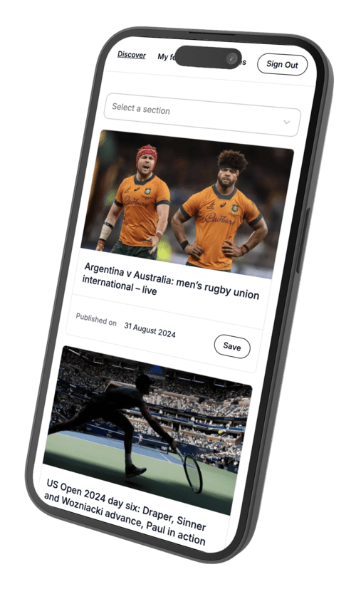
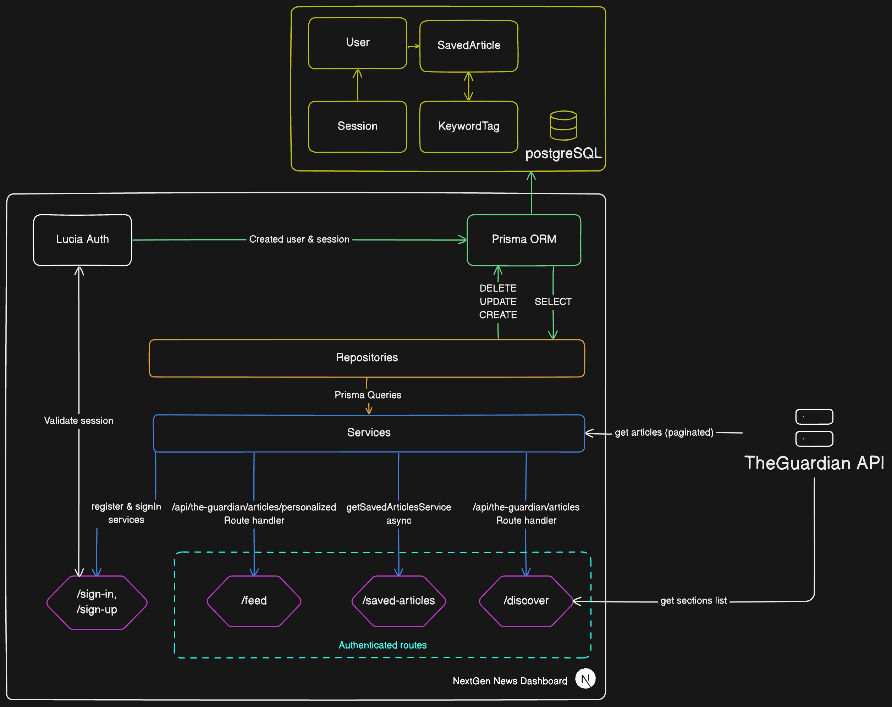

# Nextgen News Dashboard

**DEMO** : https://nextgen-news-dashboard-production.up.railway.app/

## Stack used

- Authentication (Lucia)
- Tailwind CSS
- Next.js
- TypeScript
- Playwright
- Prisma

## Architecture

## How to Get Started

### Prerequisites

This app does uses Docker and Docker Compose to run a postgres database, so you will need to either have those installed, or modify the project to point to a hosted database solution.

## How to Run

1. `cp .env.sample .env` (make sure to fill in the necessary values, see below)
2. `yarn install`
3. `docker compose up`
4. `yarn run db:setup`
5. `yarn run dev`

## Env Setup

You'll need to following the steps below and make sure everything is setup and copy the necessary values into your .env file:

### The Guardian API

This app uses The Guardian API. You'll need to get an API key from [The Guardian](https://open-platform.theguardian.com/access/). Copy the key into your .env file as `GUARDIAN_API_KEY`.
